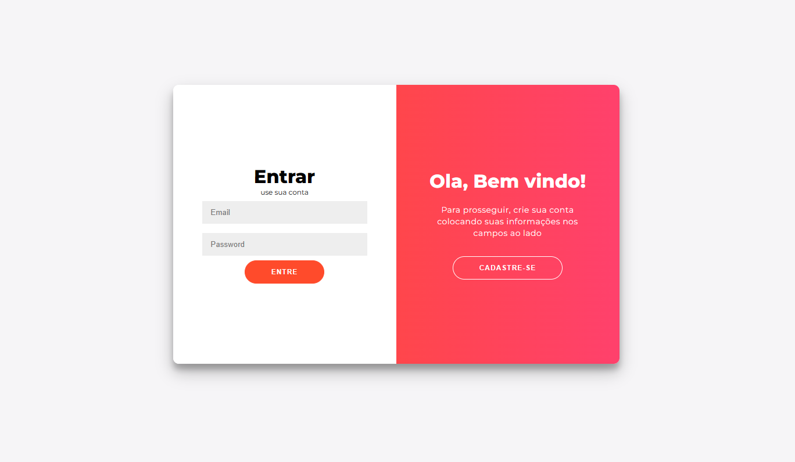
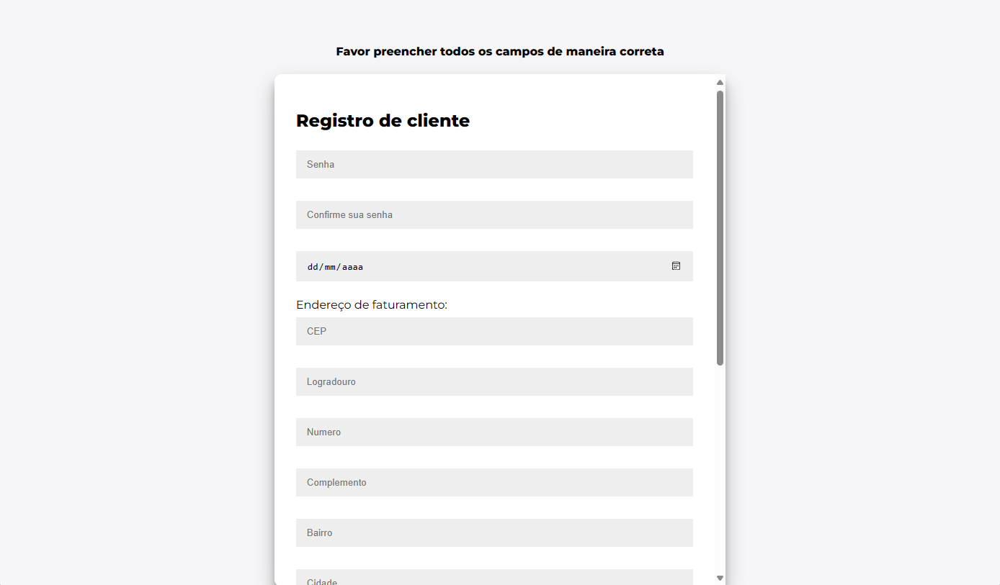
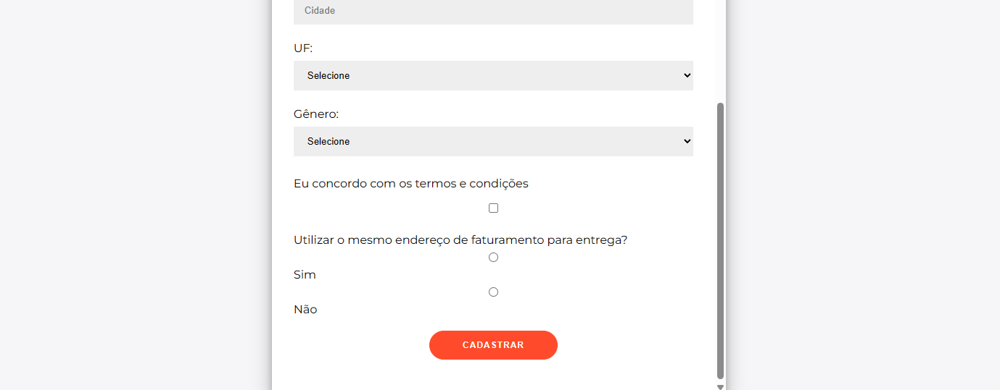
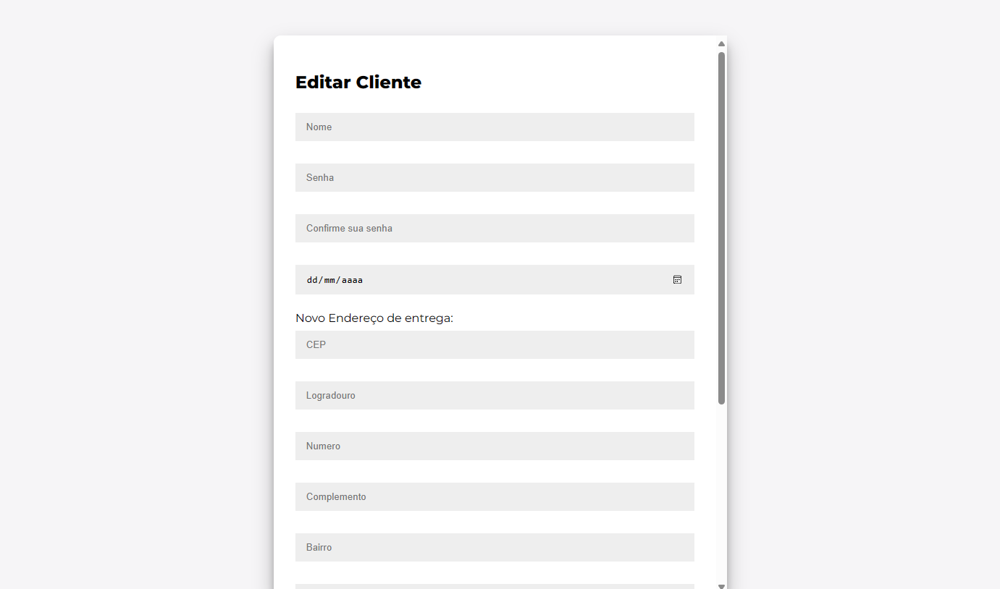
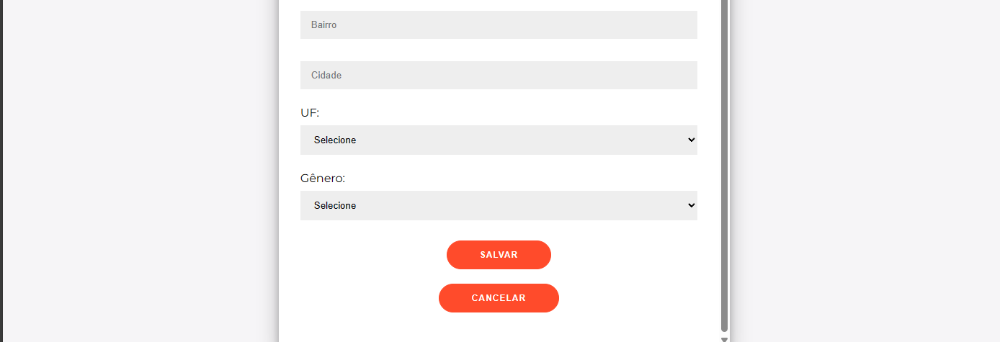

<<<<<<< HEAD
P.I - 4 semestre 

# Protótipo do Site

  
  
  
  
  

Script Banco de dados

CREATE CACHED TABLE "PUBLIC"."USUARIO"(

    "ID" INT PRIMARY KEY AUTO_INCREMENT,

    "NOME" CHARACTER VARYING(50),

    "CPF" CHARACTER VARYING(14),

    "EMAIL" CHARACTER VARYING(50),

    "SENHA" CHARACTER VARYING(255),

    "ESTATUS" CHARACTER VARYING(20),

    "GRUPO" CHARACTER VARYING(50),

    "BACKOFFICE" CHARACTER VARYING(50)

);

insert into usuario (nome, cpf, email, senha, estatus, grupo, backoffice) values ('Felipe','522.692.428-31','Felipe@gmail.com','0Ox9XCBVsKJdpA9B3HO7hQ==','Ativo','ADM,'null')
=======
# LojaGeekPI
Projeto Integrador da Faculdade que eu participei
>>>>>>> e679f338104058b12cee2adf69ea68ee14636a24
